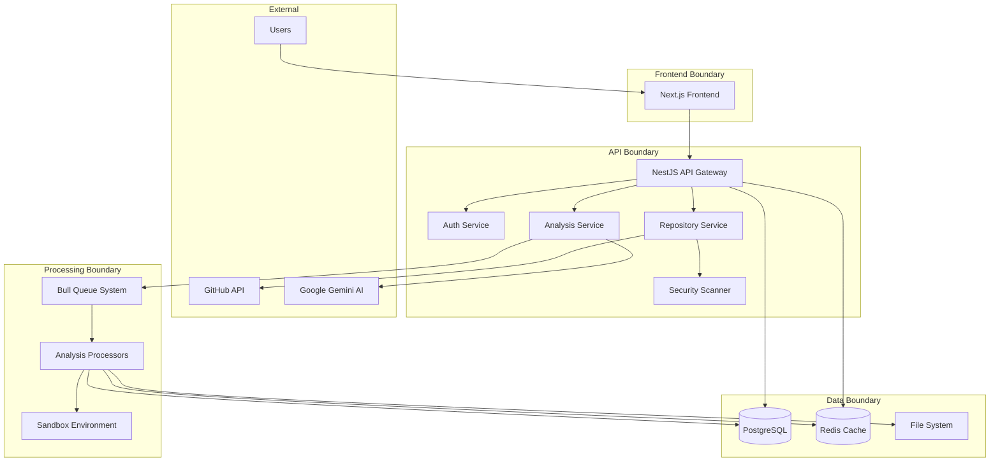

# RAYE Platform Threat Model

## Overview

This document presents a comprehensive STRIDE threat model for the RAYE code analysis platform, identifying potential security threats and their mitigations. The model covers all major components of the system including authentication, repository processing, AI services, and data storage.

## Trust Boundary Diagram

## STRIDE Threat Analysis

### SPOOFING Threats

| ID | Threat | Affected Component | Risk Level | Attack Scenario | Mitigation |
|----|--------|-------------------|------------|-----------------|------------|
| SPOOF-001 | JWT Token Forgery | Auth Service | Critical | Attacker creates forged JWT tokens to impersonate users | Strong JWT secrets, token validation, short expiry times |
| SPOOF-002 | OAuth Redirect Manipulation | Auth Service | High | Attacker manipulates OAuth state parameter to hijack accounts | Secure state generation, PKCE implementation, redirect URI validation |
| SPOOF-003 | User Impersonation via Weak Session | Auth Service | High | Weak session management allows account takeover | Secure session storage, session invalidation, IP-based session tracking |
| SPOOF-004 | Repository URL Spoofing | Repository Service | Medium | Attacker provides malicious repository URLs that appear legitimate | URL validation, GitHub API verification, allowlist domains |
| SPOOF-005 | AI Service Impersonation | Analysis Service | Medium | Attacker spoofs Gemini API responses to inject malicious content | API key validation, response integrity checks, request signing |

### TAMPERING Threats

| ID | Threat | Affected Component | Risk Level | Attack Scenario | Mitigation |
|----|--------|-------------------|------------|-----------------|------------|
| TAMP-001 | Repository Code Injection | Repository Service | Critical | Attacker uploads malicious code that executes during analysis | Security scanning, sandbox isolation, code validation |
| TAMP-002 | AI Prompt Injection | Analysis Service | High | Attacker manipulates AI prompts to generate malicious explanations | Input sanitization, prompt validation, output filtering |
| TAMP-003 | Dependency Graph Manipulation | Analysis Service | Medium | Attacker modifies dependency graph to hide malicious dependencies | Graph validation, dependency verification, checksum validation |
| TAMP-004 | Analysis Queue Manipulation | Queue System | Medium | Attacker modifies queued analysis jobs to target specific repositories | Queue encryption, job validation, access controls |
| TAMP-005 | Database Record Tampering | Data Layer | High | Attacker modifies analysis results or user data in database | Database encryption, audit logging, integrity checks |

### REPUDIATION Threats

| ID | Threat | Affected Component | Risk Level | Attack Scenario | Mitigation |
|----|--------|-------------------|------------|-----------------|------------|
| REPU-001 | Missing Audit Logs | All Services | Medium | Actions performed without traceability, denying responsibility | Comprehensive audit logging, immutable logs, log aggregation |
| REPU-002 | Explanation Generation Anonymity | Analysis Service | Low | AI explanations generated without attribution to requesting user | User attribution logging, request tracking, usage analytics |
| REPU-003 | Repository Access Denial | Repository Service | Medium | User denies accessing or modifying repository | Access logging, change tracking, user activity monitoring |
| REPU-004 | API Call Denial | API Gateway | Low | User denies making specific API calls | Request logging, IP tracking, authentication logging |
| REPU-005 | Security Scan Denial | Security Scanner | Medium | User denies triggering security scans that quarantined repositories | Scan logging, user attribution, scan result tracking |

### INFORMATION DISCLOSURE Threats

| ID | Threat | Affected Component | Risk Level | Attack Scenario | Mitigation |
|----|--------|-------------------|------------|-----------------|------------|
| INFO-001 | AI Explanation Data Leakage | Analysis Service | High | AI explanations leak proprietary code patterns or sensitive logic | Output filtering, data masking, privacy-preserving AI techniques |
| INFO-002 | Redis Cache Exposure | Cache Layer | Medium | Redis cache exposes analysis results or user sessions to unauthorized access | Redis authentication, network isolation, cache encryption |
| INFO-003 | Error Message Information Leakage | API Gateway | Medium | Error messages reveal system internals, database structure, or file paths | Generic error messages, error logging separate from user responses |
| INFO-004 | Database Schema Exposure | Data Layer | Low | Database queries expose schema information through error messages | Parameterized queries, error handling, schema obfuscation |
| INFO-005 | File System Path Disclosure | Repository Service | Medium | File operations expose internal file system structure and paths | Path validation, sandbox isolation, virtual file systems |
| INFO-006 | User Data Exposure | Auth Service | High | User emails, tokens, or personal data exposed through APIs | Data encryption, field-level encryption, access controls |

### DENIAL OF SERVICE Threats

| ID | Threat | Affected Component | Risk Level | Attack Scenario | Mitigation |
|----|--------|-------------------|------------|-----------------|------------|
| DENI-001 | Malicious Repository Infinite Loops | Sandbox | Critical | Attacker uploads repository with infinite loops that crash analysis | Resource limits, timeout enforcement, sandbox isolation |
| DENI-002 | Bull Queue Flooding | Queue System | High | Attacker floods analysis queue with jobs, preventing legitimate analysis | Rate limiting, queue size limits, priority queuing |
| DENI-003 | API Rate Limit Bypass | API Gateway | Medium | Attacker bypasses rate limits to overwhelm API endpoints | Distributed rate limiting, IP tracking, request validation |
| DENI-004 | Database Connection Exhaustion | Data Layer | High | Attacker creates connections that exhaust database connection pool | Connection pooling, connection limits, query optimization |
| DENI-005 | File System Exhaustion | File System | Medium | Attacker uploads large files that exhaust disk space | File size limits, storage quotas, cleanup processes |
| DENI-006 | Memory Exhaustion in Analysis | Analysis Processors | High | Attacker triggers memory-intensive analysis that exhausts system memory | Memory limits, process isolation, resource monitoring |

### ELEVATION OF PRIVILEGE Threats

| ID | Threat | Affected Component | Risk Level | Attack Scenario | Mitigation |
|----|--------|-------------------|------------|-----------------|------------|
| ELEV-001 | Role Confusion (Free vs Pro) | Auth Service | Medium | Attacker exploits role confusion to access premium features | Role validation, feature gating, permission checks |
| ELEV-002 | Sandbox Escape to Host System | Sandbox | Critical | Attacker escapes sandbox to gain host system access | Container hardening, seccomp filters, minimal privileges |
| ELEV-003 | Database Direct Access | Data Layer | High | Attacker gains direct database access bypassing application controls | Database authentication, network isolation, principle of least privilege |
| ELEV-004 | Redis Privilege Escalation | Cache Layer | Medium | Attacker exploits Redis configuration to gain system access | Redis authentication, sandboxed Redis, limited command set |
| ELEV-005 | File System Privilege Escalation | File System | Medium | Attacker exploits file system permissions to access unauthorized files | File permissions, sandbox isolation, virtual file systems |
| ELEV-006 | API Key Privilege Escalation | External Services | High | Attacker escalates privileges in external services (GitHub, Gemini) | API key rotation, least privilege access, service account isolation |

## High-Priority Threats Summary

### Critical Risk (Requires Immediate Attention)

1. **SPOOF-001: JWT Token Forgery** - Could allow complete system compromise
2. **TAMP-001: Repository Code Injection** - Could compromise analysis infrastructure
3. **DENI-001: Malicious Repository Infinite Loops** - Could crash analysis system
4. **ELEV-002: Sandbox Escape** - Could provide host system access

### High Risk (Address Soon)

1. **SPOOF-002: OAuth Redirect Manipulation** - Account takeover risk
2. **INFO-001: AI Explanation Data Leakage** - Intellectual property exposure
3. **DENI-002: Bull Queue Flooding** - Service availability impact
4. **ELEV-003: Database Direct Access** - Data breach risk

### Medium Risk (Plan for Future Releases)

1. **REPU-001: Missing Audit Logs** - Compliance and forensics impact
2. **TAMP-002: AI Prompt Injection** - Data integrity concerns
3. **INFO-003: Error Message Information Leakage** - Information disclosure
4. **ELEV-001: Role Confusion** - Feature abuse potential

## Security Controls Implementation Status

### ✅ Implemented Controls

- **Authentication**: JWT with secure secrets, rate limiting, account lockout
- **Authorization**: Role-based access control, repository ownership checks
- **Input Validation**: URL validation, DTO validation, file upload restrictions
- **Security Scanning**: Secret detection, malicious code scanning, quarantine system
- **Sandboxing**: Resource limits, syscall filtering, isolation policies
- **Encryption**: Field-level encryption, TLS configuration, key management
- **Rate Limiting**: Distributed rate limiting, IP-based tracking
- **Audit Logging**: Security audit trails, scan result logging

### 🔄 In Progress Controls

- **Dependency Auditing**: CVE checking, vulnerability database integration
- **Threat Detection**: Suspicious activity monitoring, anomaly detection
- **Incident Response**: Security incident procedures, alerting systems

### 📋 Planned Controls

- **Advanced Monitoring**: Real-time security monitoring, SIEM integration
- **Penetration Testing**: Regular security assessments, vulnerability scanning
- **Compliance**: GDPR compliance, data protection impact assessments
- **Security Training**: Security awareness training for development team

## Recommendations

### Immediate Actions (Next 30 Days)

1. **Enhance JWT Security**: Implement token rotation and refresh token validation
2. **Strengthen Sandbox**: Add additional isolation layers and monitoring
3. **Implement Advanced Rate Limiting**: Add user-based and feature-based limits
4. **Security Testing**: Conduct penetration testing of critical components

### Short-term Actions (Next 90 Days)

1. **Deploy Advanced Monitoring**: Implement real-time security monitoring
2. **Enhance Audit Logging**: Add comprehensive audit trail for all actions
3. **Security Training**: Conduct security awareness training for team
4. **Compliance Review**: Ensure GDPR and data protection compliance

### Long-term Actions (Next 6 Months)

1. **Zero Trust Architecture**: Implement zero trust security model
2. **Advanced Threat Detection**: Deploy ML-based anomaly detection
3. **Security Automation**: Implement automated security response systems
4. **Regular Assessments**: Establish regular security assessment schedule

## Conclusion

This threat model identifies 25+ potential security threats across the RAYE platform, with appropriate mitigations for each identified risk. The security controls implemented provide strong protection against the most critical threats, while planned enhancements will further improve the platform's security posture.

Regular review and updates to this threat model should be conducted as the platform evolves and new threats emerge. The security team should maintain a continuous security testing program to validate the effectiveness of implemented controls.
